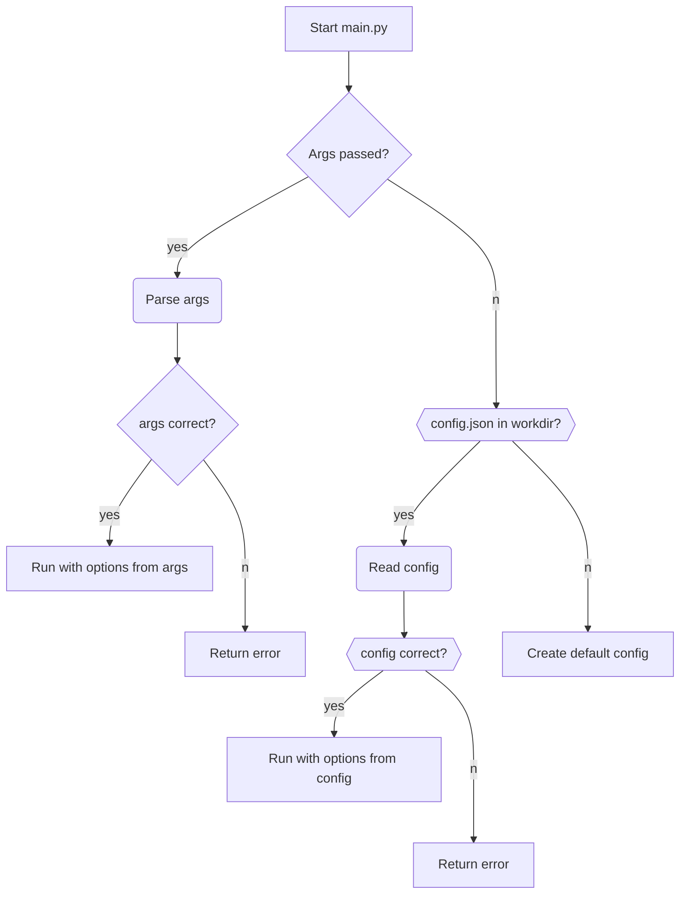
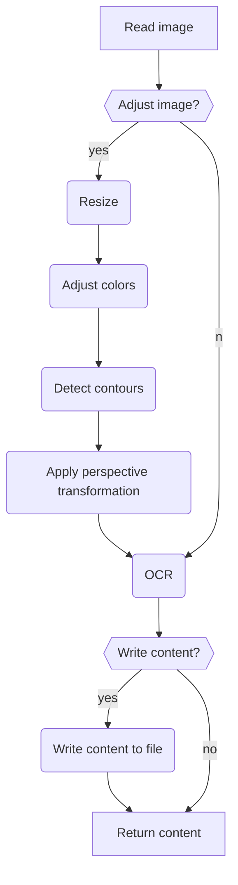

# OCR-Receipts
Application for receipt recognition 

## Process description

Flowchart for the main execution scheme.

```mermaid
flowchart TD
    A[Start main.py] --> B{Args passed?}
    B --yes--> C(Parse args)
    C --> D{args correct?}
    D --yes--> E[Run with options from args]
    D --no--> F[Return error]
    B --no--> G{{config.json in workdir?}}
    G --yes--> H(Read config)
    H --> I{{config correct?}}
    I --yes--> J[Run with options from config]
    I --no--> K[Return error]
    G --no--> X[Create default config]
```

Flowchart for image processing.

```mermaid
flowchart TD
    A[Read image] --> B{{Adjust image?}}
    B --yes--> C(Resize) --> D(Adjust colors) --> E(Detect contours)
    E --> F(Apply perspective transformation)
    F --> G(OCR)
    G --> H{{Write content?}}
    H --yes--> I(Write content to file) --> J
    H --no --> J[Return content]
    B --no--> G
```